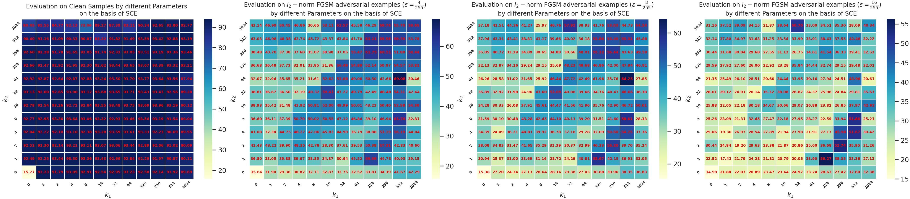

# Boosting Robustness of Neural Networks via Angular Boundary-oriented Cosine Loss Framework
## Hongtian Zhao, Hua Yang, Hang Su, Shibao Zheng
### Appendix-A
To better understand the reasons why the norm of $\boldsymbol{y}$ is supposed to be fixed as a constant, we make the following analysis. First, in $L_{Cos-SCE}$, if $s$ is replaced with $\Vert \boldsymbol{y} \Vert$, and the $\theta_{d_{i}}$ and $\theta_{\hat{d}_{i}}$ are both constants, the loss is a 
function only concerning $\Vert \boldsymbol{y} \Vert$ as independent variable. Under this premise, $(\cos{\theta_{d_{i}}}-\cos{\theta_{\hat{d}_i}}) \geq 0$ means that the model makes correct classification result with our analysis; with the increase of $\Vert \boldsymbol{y} \Vert$, 
the loss function value decreases accordingly. Conversely, if $(\cos{\theta_{d_{i}}}-\cos{\theta_{\hat{d}_i}}) \textless 0$ holds, the model would make a false prediction and the decrease of $\Vert \boldsymbol{y} \Vert$ would also result in the decrease of loss function. As a result, the magnitude of sample vector $\Vert \boldsymbol{y} \Vert$ has no influence on the model making a decision, and in fact, the decreasing trend of $\Vert \boldsymbol{y} \Vert$ may well 
just induce the model to make false predictions accumulating around the origin while the correct predictions spread far away from the origin. For validation, Fig. 3 in the body of this paper shows the sample distributions of training and test data embedded in a two-dimensional feature space obtained by a typical angular loss.
From the figure, we can see that the samples nearby the origin are more likely to be misclassified, while the samples far away from the origin have a higher probability to be accurately classified, manifesting the validity of our analysis. Thus, to decrease the undesirable behavior of features due to the magnitude difference among different types of datasets, 
we here fix the $\Vert \boldsymbol{y} \Vert$ as a constant to reduce the radial variance during training in an empirical manner.

### Appendix-B
Different from CosFace-based $L_B$ definition, hypersphere transformation (embedding) based SCE, hereinafter referred to as HT-SCE, for $L_B$ uses naive linear layer to map high-dimensional normalized features to output space and then exploit feature$\&$weights normalization, angular margin operation on these features to obtain final latent features.
Fig.~\ref{fig:six2} shows the classification accuracies on both normal samples and adversarial examples using the same setting as the Fig.

in the body of this paper by enabling HT-SCE mode in the ABCL framework.
